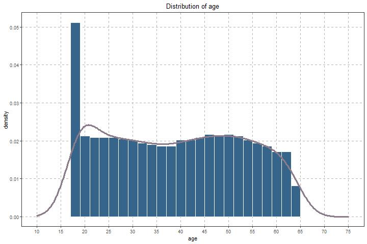
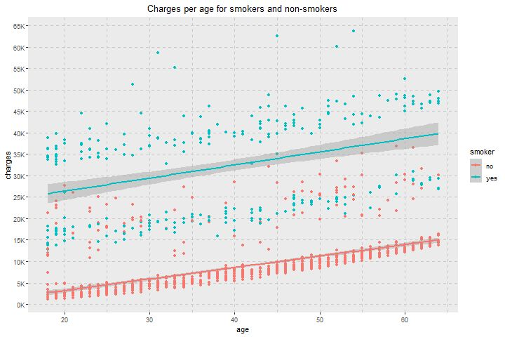

# Medical Costs Analysis and Prediction
* Exploratory Data Analysis to help understand what is correlated with medical charges
* Graphs made with ggplot2 to make an easy data viz
* Linear and Polynomial Regression with a little explanation
* Lasso, Ridge and Elastic Net Regression 
* Random Forest Regression

# EDA
After looking at the distributions, useful insights could be obtained from the data. Below are some examples.

 

# Model Building
First, the categorical variables were converted to dummy variables. After, the data was split in train and test sets with a split ratio of 0.8

I tried a lot of regression models and evaluated them using the R squared. I didn't use Mean Squared Error due to the high values of the charges.

The models built were:
* Multiple Linear Regression - The baseline
* Polynomial Regression - After realizing the data didn't fit well the linear model, I tried different curves to fit the data
* Ridge, Lasso and Elastic Net - Tried adding some penalty and normalization to the data, even with a small dataset
* Random Forest - Another approach, using a non-linear model

# Model Performance 
The performance is evaluated considering the test data. The linear regression had the worst performance, but the other ones performing quite similar, with the random forest performance a little better.

* Multiple Linear Regression -> R2 = 0.727
* Polynomial Regression -> R2 = 0.817
* Elastic Net for Linear Model-> R2 = 0.725 for nearly all $\alpha$ range
* Elastic Net for Quadratic Model-> R2 = 0.801 when $\alpha = 0.8$
* Random Forest -> R2 = 0.828
